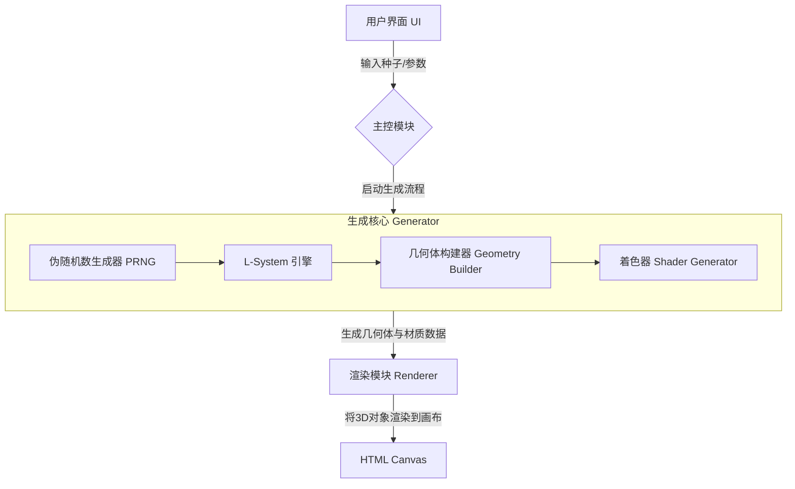

# Architecture of GenPlant Project

## 1. 项目愿景 (Project Vision)

创建一个纯前端、无需服务器的静态网页。用户只需输入一个唯一的ID（种子），或点击“随机”按钮，就能在屏幕上生成一棵形态、色彩都独一无二、符合真实自然生长规律的精美三维植物模型。整个体验轻盈、即时且富有艺术感。

## 2. 核心理念 (Core Philosophy)

数据驱动生成 (Data-Driven Generation): 植物的一切（形态、分支、颜色）都由一个初始“种子”和一套生长“规则”唯一确定。同样的种子总能生成同样的植物。
单一职责原则 (Single Responsibility Principle): 代码的每个模块只做一件事，并把它做好。例如，有的模块只负责生成规则，有的只负责根据规则画模型，有的只负责渲染。
声明式生长 (Declarative Growth): 我们不直接去画一棵树，而是定义树的“生长规则”（比如：树干会长出分叉，分叉会变细并长出叶子），然后让程序去“模拟”这个生长过程。这正是PGC的精髓。

## 3. 系统架构图 (System Architecture Diagram)



## 4. 模块详解 (Module Breakdown)

### 4.1 用户界面UI模块 (UI Module)

职责: 提供用户交互的界面。
实现要点:

- 一个 index.html 文件。
- 一个 `<input type="text">` 元素，用于输入或显示种子ID。
- 一个 `<button>` 元素，用于触发“生成”或“随机生成”事件。
- 一个 `<canvas>` 元素，作为Three.js的渲染目标。
- 界面风格：大面积的高明度、低饱和的色块，与植物的颜色搭配（浅黄、浅绿等）。
- 界面风格：现代化，扁平化设计，没有复杂的元素。
- （可选）一些 `<input type="range">` 元素，用于调整生长参数，如“迭代次数”、“弯曲角度”等，增加可玩性。
- 主脚本将作为模块加载，因此在`index.html`中应使用 `<script type="module" src="js/main.js"></script>`。

### 4.2 主控模块 (Main Controller Module)

主控模块`main.js`是整个应用的入口点和中央协调器。它本身不执行任何具体的业务逻辑（如3D模型生成或渲染），其核心职责是 初始化应用 并 编排 其他模块协同工作。
核心职责 ：

- 应用初始化 ：创建并设置渲染器模块，准备好进行渲染。
- 事件监听 ：监听用户在UI界面上的交互事件，主要是“生成”按钮的点击。
- 流程控制 ：根据用户输入，调用生成器核心来创建植物模型。
- 数据流转 ：获取用户输入的种子（Seed），将其传递给生成器；接收生成器返回的3D模型，并将其交给渲染器进行显示。

模块交互 ：

- 与UI模块 ：单向通信。从UI的输入框获取种子ID，监听按钮点击事件。
- 与生成核心 ：调用其`generate`方法，并向其传递种子ID和可能的配置参数。
- 与渲染模块 ：调用其 `add` 或 `clear` 方法，将生成的模型添加到场景中或清空场景，并驱动渲染循环。
- 初始化整个Three.js场景。

数据流向 ： 用户输入 (Seed ID) -> UI模块 -> 主控模块 -> 生成核心 -> 返回

接口定义 (API Definition)
主控模块作为入口，不向外提供API，而是定义了内部的核心流程函数。

- init()
  
  - 描述 ：应用初始化函数，在页面加载完成后立即执行。负责设置场景、绑定DOM事件监听器。
  - 参数 ：无。
  - 返回值 ：无。

- handleRandomSeedClick ()

  - 描述 ：处理“随机”按钮的点击事件。生成一个随机种子并更新UI。 
  - 参数 ：无。
  - 返回值 ：无。

- handleGenerateClick()

  - 描述 ：处理“生成”按钮的点击事件。编排整个植物生成和渲染的流程。
  - 参数 ： event (DOM事件对象)。
  - 返回值 ：无。


错误处理 (Error Handling)

- 错误捕获 ：核心的生成逻辑被包裹在 try...catch 块中。由于植物生成是计算密集型任务，最有可能在此处发生错误（如规则解析错误、参数不合法等）。
- 日志记录 ：捕获到的任何异常都会通过 console.error() 打印到开发者控制台，以便于调试。日志信息应包含错误堆栈。
- 用户反馈 ：当错误发生时，应向用户提供友好的反馈，而不是让程序静默失败。例如，可以在UI上显示一条消息：“植物生成失败，请尝试更换一个种子或刷新页面。”
- 错误恢复 ：作为一个纯前端应用，最简单有效的恢复机制是允许用户尝试使用新的种子重新生成，或直接刷新页面回到初始状态。

可扩展性与维护性 (Extensibility & Maintainability)

- 模块化 ：通过ES Module导入/导出， main.js 与 generator.js 和 renderer.js 完全解耦。只要其他模块的接口（如 generator.generate ）保持稳定，其内部实现可以任意修改和优化，而无需改动主控模块。
- 低耦合、高内聚 ：主控模块的功能高度内聚于“协调”这一职责。它不了解L-System的具体规则，也不知道渲染器使用的是何种光照模型，实现了高度的低耦合。
- 配置驱动 ：未来如果需要增加可调整的参数（如迭代次数、弯曲角度），只需将它们从UI收集起来，打包成一个配置对象传给 generator.generate(seed, config) 即可，无需修改现有函数的签名，扩展性强。


### 4.3 生成核心模块 (Main Generator Module)

#### 4.3.1. 伪随机数生成器 (PRNG - Pseudo-Random Number Generator)

职责: 提供一个“可预测”的随机数源。不同于Math.random()，只要种子相同，它产生的随机数序列就永远相同。这是保证“相同ID生成相同植物”的关键。
实现要点: 可以使用一个简单的PRNG函数（如mulberry32），用种子ID初始化它。之后，植物生长过程中所有的“随机”决策（如：分支角度、长度、颜色）都向它请求随机数。

#### 4.3.2. L-System 引擎 (Lindenmayer System)

职责: 这是模拟自然生长最经典、最简单也最强大的算法。它通过一套简单的“重写规则”来生成复杂的字符串，这个字符串就是植物的“生长蓝图”。
实现要点:

- 公理 (Axiom): 生长的起点，一个初始字符串，比如 "F" (代表树干)。
- 规则 (Rules): 定义如何迭代。比如一条规则可以是 F -> F[+F]F[-F]，意思是“一根树干(F)会生长成一根更长的树干(F)，并在中间分叉，一个向左(+F)，一个向右(-F)”。
- 迭代 (Iteration): 将规则重复应用到字符串上。迭代次数越多，植物就越复杂、越成熟。
- 这个引擎的输入是公理、规则和迭代次数，输出是一个长长的指令字符串，例如 "F[+F[+F]F[-F]]F[-F[+F]F[-F]]"。PRNG可以在此阶段介入，用于选择不同的生长规则，创造更多变数。

#### 4.3.3 几何体构建器 (Geometry Builder)

职责: 翻译L-System生成的“生长蓝图”字符串，将其转换成Three.js可以理解的3D几何体（顶点、面）。
实现要点:

- 想象有一只“小海龟”在3D空间中移动。
- 逐一读取指令字符串中的每个字符：
  - F: 海龟向前移动一段距离，并留下一段圆柱体作为树枝。
  - +: 海龟向右转一个角度。
  - -: 海龟向左转一个角度。
  - [: 保存海龟当前的位置和姿态（入栈）。这通常是分叉的开始。
  - ]: 恢复海龟之前保存的位置和姿态（出栈）。这让你能回到分叉点，生长另一根树枝。
- 在海龟移动的过程中，记录下所有圆柱体（树枝）和球体（连接点）的几何信息。最终将它们合并成一个单一的BufferGeometry，这样性能最高。
- 贴图/颜色: 在创建几何体时，可以根据树枝的深度、年龄或PRNG的输出来决定它的颜色（顶点着色），从而实现从深褐色树干到嫩绿色新芽的平滑过渡。这是最简单也最高效的“贴图”方式，无需复杂的UV展开和图片纹理。


### 4.3.4 着色器生成器 (Shader Generator)

职责: 为几何体生成自定义的着色器程序，实现复杂的材质效果。
实现要点：

- 根据几何体的顶点以及面的片元数据来自动生成相关数据。
  - 漫反射颜色
  - 高光颜色
  - 透明度
  - 粗糙度
- 在生成几何体顶点与面的数据同时来生成颜色数据（或者保留为贴图）。


### 4.4 渲染模块 (Renderer Module)

职责: 设置和管理所有Three.js的渲染工作。
实现要点:

- 创建Scene（场景）、Camera（相机）、WebGLRenderer（渲染器）。
- 设置光源，比如AmbientLight（环境光）和DirectionalLight（平行光），好的光照是模型精致感的关键。
- 提供一个add(object)方法，让主控模块可以把生成的植物模型添加进来。
- 提供一个render()方法，在循环中不断重绘场景。
- （推荐）集成OrbitControls，让用户可以用鼠标方便地旋转、缩放、平移观察植物。
- 在文件顶部导入Three.js核心库: `import * as THREE from '../libs/three.module.js';`
- 如需使用控制器，同样需要导入: `import { OrbitControls } from '../libs/OrbitControls.js';`

## 5. 数据流 (Data Flow)

1. 启动: 页面加载，Main.js初始化一个空的Renderer.js场景。
2. 交互: 用户在UI中输入"my-beautiful-plant"作为种子，点击“生成”。
3. 触发: Main.js监听到点击事件，清空旧的植物模型。
4. 生成:

- Main.js调用 Generator.generate("my-beautiful-plant")。
- Generator内部，PRNG以"my-beautiful-plant"为种子进行初始化。
- L-System引擎使用PRNG提供的随机决策，迭代生成生长指令字符串。
- Geometry Builder 解析该字符串，一步步构建出植物的BufferGeometry。
- Shader Generator 为几何体进行着色。
- Main Generator将这个几何体与一个支持顶点着色的Material组合成一个THREE.Mesh对象，并返回给Main.js。

1. 渲染: Main.js调用 Renderer.add(plantMesh)，将植物模型添加到场景中。
2. 显示: Renderer的渲染循环自动将包含新植物的场景绘制到<canvas>上。


## 文件结构（File Structure）

```bash
/GenPlant
|-- index.html              # 唯一的HTML文件
|-- style.css               # 样式文件，让界面更美观
|-- /js
|   |-- main.js             # 主控模块，应用入口
|   |-- /generator          # 核心：包含PRNG, L-System, Turtle逻辑
|   |   |-- generator.js    # 生成核心模块
|   |   |-- prng.js         # 伪随机数生成器
|   |   |-- lsystem.js      # L-System引擎
|   |   |-- geometry.js     # 几何体构建器
|   |   |-- shader.js       # 着色器生成器
|   |-- renderer.js         # Three.js场景设置与渲染
|   |-- /libs               # 存放第三方库 (ES Module 版本)
|       |-- three.module.min.js # Three.js 核心库
|       |-- OrbitControls.js  # 轨道控制器模块
```

## 6. 开发环境 (Development Environment)

由于项目采用了ES模块，无法通过 `file://` 协议直接在浏览器中打开 `index.html` 文件。**必须使用本地开发服务器来运行项目。**


To be continued...

